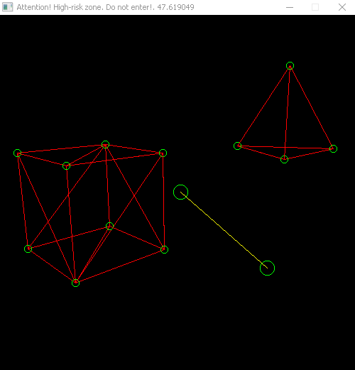

### About

This project is used for computer graphic researching. There is 2D and 3D graphics.
#### Required dependencies:
- C++
- sdl2 (for drawing surface)
- glm (for vectors and matrixes)

#### Feateres

Common:
- [x] fps limit
- [x] fps counter

2D:
- [x] the Bresenham line algorithm
- [x] scan-line polygone filling
- [x] the Bresenham circle algorithm
- [ ] the circle filling
- [x] the Cohen Sutherland line clipping algorithm for square vision

3D:
- [x] reading object data from .obj file:
- reading is allowed for only triangle polygon objects
- [x] camera controller:
- plane-parallel movement
- correct camera rotating using quaternions
- [x] the Cohen Sutherland line clipping algorithm for pyramid of vision
- [ ] object fiiling
- [ ] polygon clipping

#### Control

- W, A, S, D -- moving along Oxz surface
- Space, C -- moving up and down
- mouse movement -- rotating

#### Files

click

<ul>
  <li>main -- the beginning of everything</li>
  <li>window -- window initial and parameters</li>
  
  <li>canvas -- 2D graphics</li>
  <li>scene -- 3D graphics</li>

  <li>object -- 3D object with object reader</li>
  <li>camera -- 3D camera object</li>
  <li>utility tools:</li>
  <ul> 
	<li>tools -- all definitions and utility functions</li>
	<li>quaternion -- quaternion class</li>
	<li>smartArray -- resizeable array with auto memory release</li>
	<li>Objects folder -- .obj collection</li>
  </ul>
  <li>prog.exe -- usefull file</li>
</ul>

#### images

